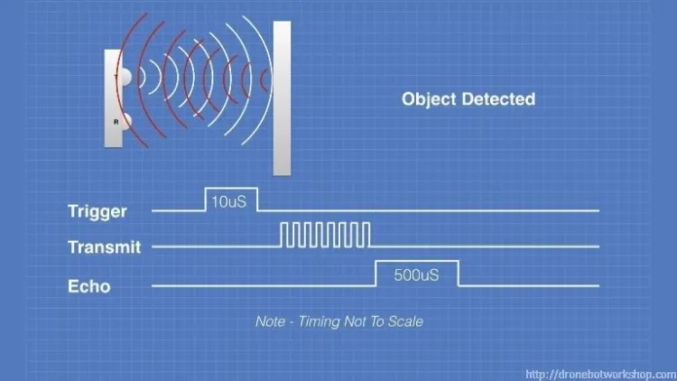

# Pagtingin (Obstacle Detecting Glasses)

## Project Aims

The Pagtingin obstacle detecting glasses aims to help visually impaired people to easily detect obstacles in front of them through innovative glasses. While traditional walking sticks indeed help in detecting obstacles on the ground, they often fail to identify objects at chest or head level, such as low-hanging branches, open cabinets, or protruding signs. 

Hence, Pagtingin aims to aid this limitation and ensure a safe journey of navigation. Whether indoors or outdoors, the device will be able to identify potential hazards through an ultrasonic sensor and send real-time audio or tactile feedback, which helps users to be much more confident and safe in the user's day-to-day lives.

## Contents of the Project

In my proposed system, an ultrasonic sensor is placed in front of the user's glasses. The ultrasonic sensor will provide information to the glasses before audio or tactile feedback will be sent to the user.

## How does it work?

### Detection
Whenever the glasses detects an obstacle in front of the user within the 50 centimeter range, the ultrasonic sensor will send a signal to the glasses for readings.

## Feedback
After the detection phase, the glasses will use the readings in order to release an audio feedback relative to the distance in cm of the ultrasonic sensor to an obstacle.

If the obstacle is close enough (roughly 50cm) then the glasses will alert via a voice message. Once the user approaches within the 30cm mark,the buzzer will beep fasteer and faster as the user gets close.

Demonstration

# Circuit Diagram

## Components Needed
- 1 * Raspberry Pi Pico 
- 1 * 9V Alkaline Battery (with a 9V battery connector)
- 1 * Short Solderless Breadboard
- 1 * HY-SRF05 Ultrasonic distance sensor
- 1 * 1W, 8Ω Portable Speaker
- 1 * LM7805 Voltage Regulator
- 1 * Active Piezzo Buzzer
- 1 * PAM8403 Audio Amplifier
- 1 * 1µF capacitor,one electrolytic
- 1 * 10µF electrolytic capacitor
- 1 * 1nF capacitor
- 1 * 6.6KΩ Resistor  
- A bundle of jumper wires

## Flashing on the Raspberry Pi Pico
1. Hold the BOOTSEL button of the Raspberry Pi Pico
2. Simultaneously, whilst holding it, connect a USB cable to the Pico and let go of the BOOTSEL afterwards
3. Drag and drop the main.uf2 file on the drive of the Raspberry Pi Pico

## Learning Outcomes

By the end of the project, I wish to strenghthen my understanding of these topics:

- Understand the basics of programming programming a Raspberry Pi Pico, specifically in its C/C++ SDK.
- Apply the basics of circuit theory such as op amps, RC Low pass filters, and electrical circuit applications.
- Experience how to make a device with an embedded system, and the ergonomics behind them.
- Love engineeeing more

## Project Status
The project is currently in its prototype form. An improved version will have more features and improvements to the design of the system coming soon. 

## Support

For questions, suggestions, or collaborations, feel free to contact the maintainer:

Niq Suguitan

- Github: @Niqtan

- Discord Username: snorelaxe14

- Email: niqban123@gmail.com

Thank you for checking out Pagtingin -- empowering with vision!
