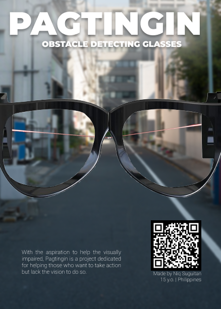

# Pagtingin (Obstacle Detecting Glasses)

## Demonstration
https://www.youtube.com/watch?v=mGvRfI-a0dM

## Project Aims

The Pagtingin obstacle detecting glasses aims to help visually impaired people to easily detect obstacles in front of them through innovative glasses. While traditional walking sticks indeed help in detecting obstacles on the ground, they often fail to identify objects at chest or head level, such as low-hanging branches, open cabinets, or protruding signs.

Hence, Pagtingin aims to aid this limitation and ensure a safe journey of navigation. Whether indoors or outdoors, the device will be able to identify potential hazards through a Time-of-Flight sensor and send real-time audio feedback, which helps users to be much more confident and safe in the user's day-to-day lives.

Courtesy of Freepik

## Contents of the Project

In my proposed system, an Time- sensor is on both ends of the glasses temple. The Time-of-Flight will provide information to the glasses before beep sounds are sent to the user.

## How does it work?

### Detection
Whenever the glasses detects an obstacle in front of the user within the 50 centimeter range, a Time-of-Flight will send a signal to the microcontroller unit for readings.

## Feedback
After the detection phase, the glasses will use the distance readings in order to release an audio feedback relative to the distance in centimeters (cm) of the ultrasonic sensor to an obstacle.

## A Message
Oh.. engineering.... Initially, I thought this project would be easy, yet it seems that wouldn't be the case. Almost 8 months working on it back and forth...

I remember the first time I tried making this project was back in December where I was just a beginner to electronics haha. So much for a first project. Now here we are, having my first ever prototype PCB, and also my first EVER PCB. I've never thought that this would get that far, considering how my motivation was dropping. Yet, I reminded myself that I loved doing this. I loved being able to create things that I once imagined. Now look at where it has brought me. 

Hopefully, you reader, also get to find this inspiration. It may not be engineering but some other field. You'll find your path someday, I believe in you.

## Project Status
The project is currently in its PCB prototype form. An improved version will have more features and improvements to the design of the system coming soon. 

## Support

For questions, suggestions, or collaborations, feel free to contact the engineeer:

Niq Suguitan

- Github: @Niqtan

- Discord Username: snorelaxe14

- Email: niqban123@gmail.com

Thank you for checking out Pagtingin -- empowering with vision!